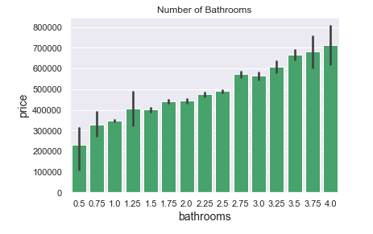

# Module 2 Final Project
### Sell Your Home For More: King County Homes

**Author**: Lauren Esser

*The contents of this repository detail an analysis of the module two project. This analysis is detailed in hopes of making the work accessible and replicable.*

### Business problem:
Selling a home can be stressful, homeowners ask themselves the question "What can I do to increase the value of my home?" Not knowing where to start may be a waste of time and money. During this project I worked on tackling that exact question for homeowners. Using the King County House Dataset I identified with at least 75% accuracy which features home owners can focus on in order to sell their place of residence at a higher price point.

### Data
Data comes from 'kc_house_data.csv' which is a housing dataset from King County near Seattle, Washington. The dataset contains 21 different features listed and explained below:

* *id* - identification for each home
* *date* - date house was sold
* *price* - is the prediction target
* *bedrooms* - number of bedrooms in the home
* *bathrooms* - number of bathrooms in the home
* *sqft_living* - square footage of the home
* *sqft_lot* - square footage of the lot
* *floors* - total floors or levels in the home
* *waterfront* - if the house has a view of waterfront
* *view* - number of viewings the property received
* *condition* - overall condition of home. 1 = worn out; 5 = excellent
* *grade* - classification by construction quality which refers to the types of materials used and the quality of workmanship. Better quality equals higher grade.
* *sqft_above* - square footage of home apart from basement
* *sqft_basement* - square footage of basement
* *yr_built* - year the home was built
* *yr_renovated* - year the home was renovated
* *zipcode* - zipcode location
* *lat* - latitude coordinate
* *long* - longitude coordinate
* *sqft_living15* - square footage of living space for nearest 15 neighbors
* *sqft_lot15* - square footage of the lot for nearest 15 neighbors.

### Methods
Throughout this linear regression project I used the OSEMN framework to help guide my decisions. 
1. *Obtain Data*
* Checked for duplicates - many homes sold more than one time.
* Dropped id column - Not needed for model.
* Inspected information about dataset.
2. *Scrub* 
* Created categorical columns variable
* Switched sqft_basement to float
* Handled null values - replace ? with 0, fill Nan with 0, drop rows if less than 5% of column.
* Checked for abnormal symbols or characters.
3. *Explore* 
* Ran initial model - statsmodels is used to fit the data using OLS analysis
* One hot encoded categorical columns (zipcode and condition)
* Checked for multicollinearity - checked for over .75 multicollinearity and used vif.
* Examined outliers - looked at zscore and IQR. Used IQR to removed outliers.
* Removed high p-values (greater than .05).
4. *Model* 
* Ran log transformation to improve normality
* Ran regression model validation using train_test_split
5. *Interpret* 
* Discussion of findings.
* Recommended improvements: increase number of bedrooms and bathrooms, use high grade material while building, purchase a house that is waterfront, have at least 3 viewings before selling your home, and consider location.
    
    
**Required Libraries**: pandas, numpy, matplotlib.pyplot, seaborn, statsmodels, interact, scipy.stats, sklearn

### Results

Below we can see that the location of the home plays a large role in how much the house sells for. Properity in the north part of the county sell for much more than the south side.

**Zipcode vs Price of Home**

The first model was created using OLS analysis through statsmodels.formula.api. Seen below, we began with an R-squared of .809. Although this number appears high, when we look at our QQ-plot we can see there are extreme outliers than need to be taken care of.

**First OLS Model**

Throughout the jupyter notebook tried to improve the OLS analysis and QQPlot by removing outliers, checking for multicollinearity, and performing log transformation. Pictured below is the final OLS Analysis of the King County Housing Data. The R-squared value ended at .792 and a QQPlot with light tails. 

**Final OLS Model**

### Recommendations:
Based on found regression model stakeholders should:
1. Increase the number of bedrooms and bathrooms in the home

2. Use high grade material while building

3. Purchase a house that is waterfront

4. Have at least 3 viewings before selling the home

5. Consider location.

### Limitations & Next Steps
Given the opportunity with this project I would love to see the impact school districts, walkability, type of home, and time of year the house was sold have on the selling price of a home. 

### For further information
Please review the jupyter notebook or presentation for more information.

For any additional questions, please contact **CLEsser02@gmail.com**)

### Repository Structure:

* README.md                       <- README for reviewers of this project.
* housing.ipynb             <- narrative documentation of analysis in jupyter notebook
* presentation.pdf                <- pdf version of project presentation

 
 

